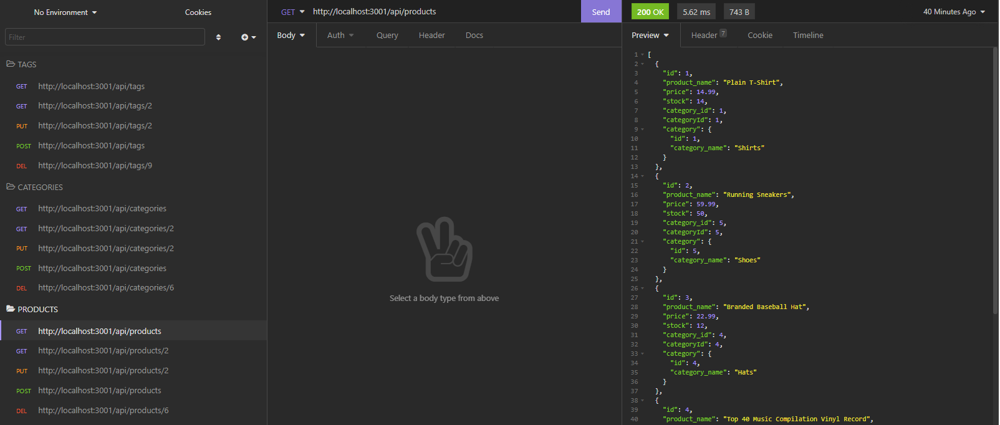

# E-Commerce Back-End

## Overview
This assignment asked us to create the back-end for an e-commerce website using Express.js, Sequelize and MySQL. The database contains four tables: products, categories, tags, and product_tags as a junction table. GET, PUT, POST and DELETE requests were to be made for the three individual tables. GET requests displayed all or a single item. PUT requests updated an existing item. POST requests created a new item. DELETE requests removed existing rows. Functionality was tested using Insomnia and recorded using Screencastify.

## Demonstration
[Screencastify Video Link](https://watch.screencastify.com/v/IhmLdsiUEYFgHscDNJRz)

## Primary Technologies Used
* Express.js
* MySQL2
* Sequelize

## Preview
